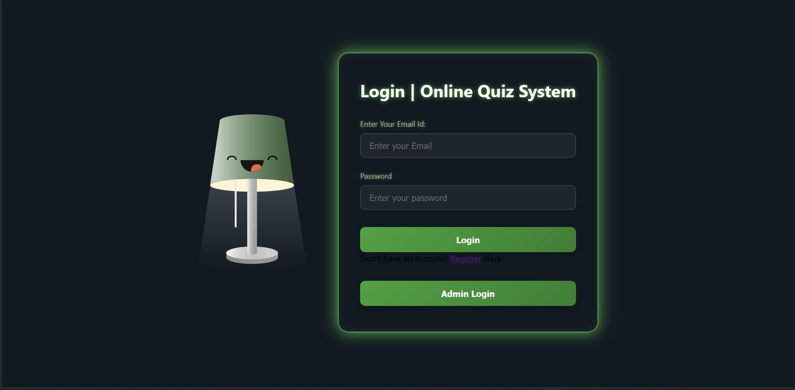

# 📝 ONLINE QUIZ SYSTEM  
**Developed By: Amarjeet Sharma**

Online Quiz System is a fast, accurate and paperless examination method used by modern organizations, institutes, and companies. It reduces manpower, evaluates answers instantly, and generates results in seconds which makes the entire examination process smooth and efficient.

---

## 🚀 Features
- Beautiful and user-friendly quiz interface  
- Timer-based MCQ quizzes  
- Auto checking and instant results  
- Secure login system  
- Admin panel to add, update & delete questions  
- Performance tracking  
- Works smoothly on all major browsers  
- Saves time and is environment friendly

---

## 🛠️ Technologies Used  

  

---

## 📚 Project Overview
Today, almost all organizations conduct their tests online. This project demonstrates how an online quiz works from backend to frontend using PHP and MySQL.  
It helps students understand:
- How automatic evaluation works  
- How database manages questions  
- How results are generated instantly  
- How login, sessions, and performance tracking is implemented  

This is an excellent learning project for PHP beginners and web development students.

---

## 📸 Screenshots  

---

## 🧑‍💻 Developer Info
**Name:** Amarjeet Sharma  
GitHub: [https://github.com/amarjeetsharma123](http://github.com/Amarjeetsharma123)  
LinkedIn: [https://linkedin.com/in/amarjeetsh239 ](https://www.linkedin.com/in/amarjeetsh239/)  
Portfolio: [https://amarjeetsharma123.github.io ](https://amarjeetsharma123.github.io/amarjeetsh.github.io/) 

---

### ✨ Keep the Motivation Alive  
Enjoyed the project? Hit that ⭐ button and make my day!

